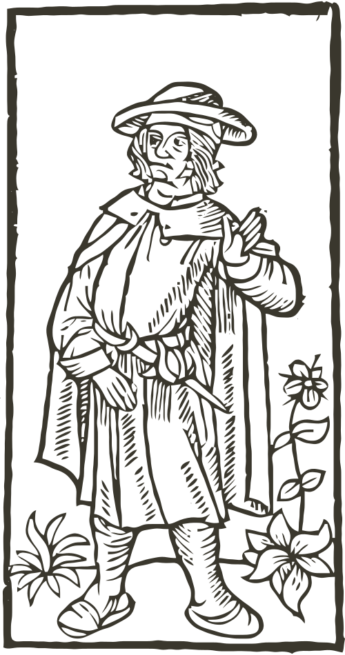

# Eine nette Ballade,  Villon dem König aus der Verbannung ſandte

¶ Ich, Franz Villon, ein Dichter und Vagant,  
Franzose und verbannt aus meinem Vaterland:  
mich kitzelt der Geruch der großen Stadt  
ich brauche Raum, und habe nicht einmal  
für meinen Kopf ein Futteral  
Ich hab den Hetzhund endlich satt,  
der mich durch die verfaulten Wälder treibt.  
Ich bin ein ganzes Jahr schon unbeweibt.

¶ Du aber weißt, wie reißend mich das Blut bewegt  
wie mein Gehirn durch alle Himmel fegt,  
ich hab dir mehr als einen Reim geschenkt,  
da war noch Würze drin und Salz.  
Jetzt klebt ein Schandfleck rot an meinem Hals,  
und wer mich fängt und henkt,  
streicht hundert Golddukaten ein;  
soll das mein Leben lang dein Wille sein?

¶ Sieh her, ich trage auf der grauen Haut  
nur diesen Rock; der ist geklaut  
und stinkt nach Muff und Mottenfraß  
Sieh her, am Knie ein Loch: so groß  
wie eine Faust… Wer bin ich bloß
daß ich zu Mist und Aas  
verdammt bin? Ich, Villon aus Groß-Paris,  
Professor einst, und Herr vom goldnen Vließ.

¶ … mein Bruder, hör: wozu bist du so stolz  
auf einen Thron gesetzt, wenn du wie Holz  
dich anfühlst und nicht schreist:  
„Schafft den Villon mir her, zieht ihm ein Kleid  
von Seide an. Ist höchste Zeit,  
daß die Durchlaucht mit mir zu Abend speist!“  
… mein Bruder, hör, ich hab nur Wind im Darm,  
und bin, wie keine Laus, so arm.

Untertänigste Nachschrift

¶ Auch so ein König neigt zuweilen sich  
zu seinem Untertan herab, und denkt wie ich:  
daß alle Menschen groß und klein  
am Ende sollen Brüder sein.

> Coment Bifon Boit asonaouiela
> belle seheaulmiecesoy cöpsainant.

> Abuis meftqueiop regretter
> La beflequi fut heaulmicre
> Sopieune fille souhaicter
> t patler en cefte maniere
> ha Viellessefelonneet fiere
> pout quop mae fitoftabatue
> Duime tient qui:que ne me siere
> Etqueace coupic neme tue
